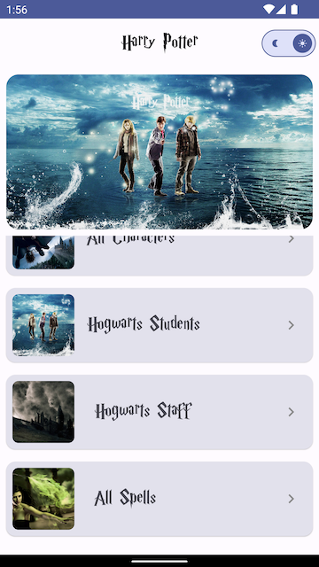
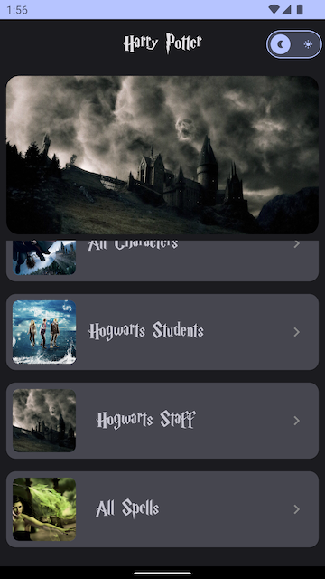
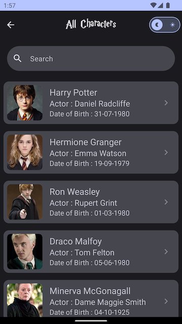

# Harry Potter Android App

An Android application that allows users to explore the magical world of Harry Potter. This app is built using Android Jetpack Compose, Hilt, MVVM architecture, Coroutine, and follows a modular design. It supports both dark and light modes for user convenience.

## App Features

1. **Harry Potter All Characters**: Browse through a list of all characters in the Harry Potter universe.

2. **Hogwarts Students**: Discover the students of Hogwarts School of Witchcraft and Wizardry.

3. **Hogwarts Staffs**: Explore the staff members at Hogwarts.

4. **All Spells**: Access a comprehensive list of all the magical spells in the wizarding world.

5. **Character Details**: Get detailed information about each character, including their background and magical abilities.

## Project Structure

The project is organized into modular components for a clean and maintainable codebase:

- **app**: The main Android app module.
- **data**: Contains data sources and repositories.
- **domain**: Defines the domain model and use cases.
- **presentation**: Compose UI components and ViewModels.
- **di**: Hilt dependency injection setup.
- **util**: Utility classes and extensions.
- **theme**: Dark and light theme configuration.

## Code Comments

This project emphasizes code readability and maintainability. All functions and significant code sections are documented with comments to help developers understand the purpose and functionality of each part. Feel free to explore the codebase and make contributions.

## Getting Started

1. Clone the repository:

2. Open the project in Android Studio.

3. Build and run the app on an Android emulator or physical device.

## Screenshots

## Contributing

We welcome contributions from the open-source community. If you'd like to contribute to this project, please follow our [contributing guidelines](CONTRIBUTING.md).

## License

This project is licensed under the MIT License - see the [LICENSE](LICENSE) file for details.

